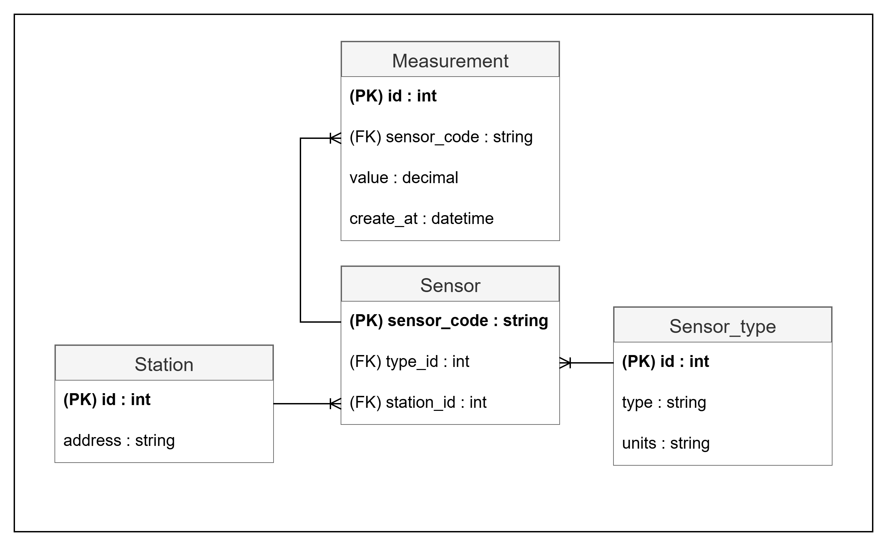
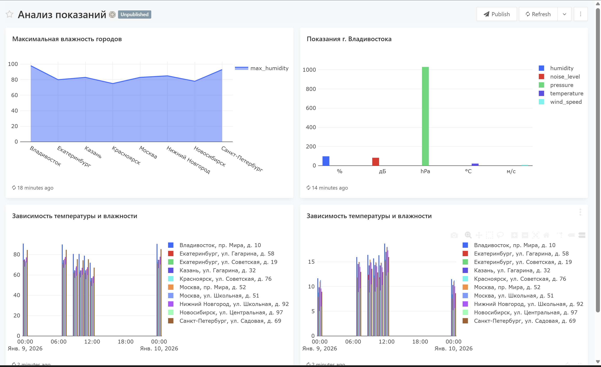

## Задние: Мини-система сбора и анализа данных для ПО "Погодная станция"

На данном рисунке изображена ER-диаграмма для БД, используемой при выполнении задания.


#### Требования:

Для работы с проектом на компьютере должен быть установлен Docker и DockerDekstop. А также должны быть свободны порты 80, 3306, 5000

#### Начало работы:

- склонируйте данный репозиторий с помощью команды

```
git clone https://github.com/baget0chka/weather-station
```

- переименуйте файл .env.example в файл .env и замениете пароли

- находясь в папке с проектом запустите его с помощью команды

```
docker-compose up -d
```

<b>Пример созданного дашборда на Redash с помощью данного проекта:</b>

